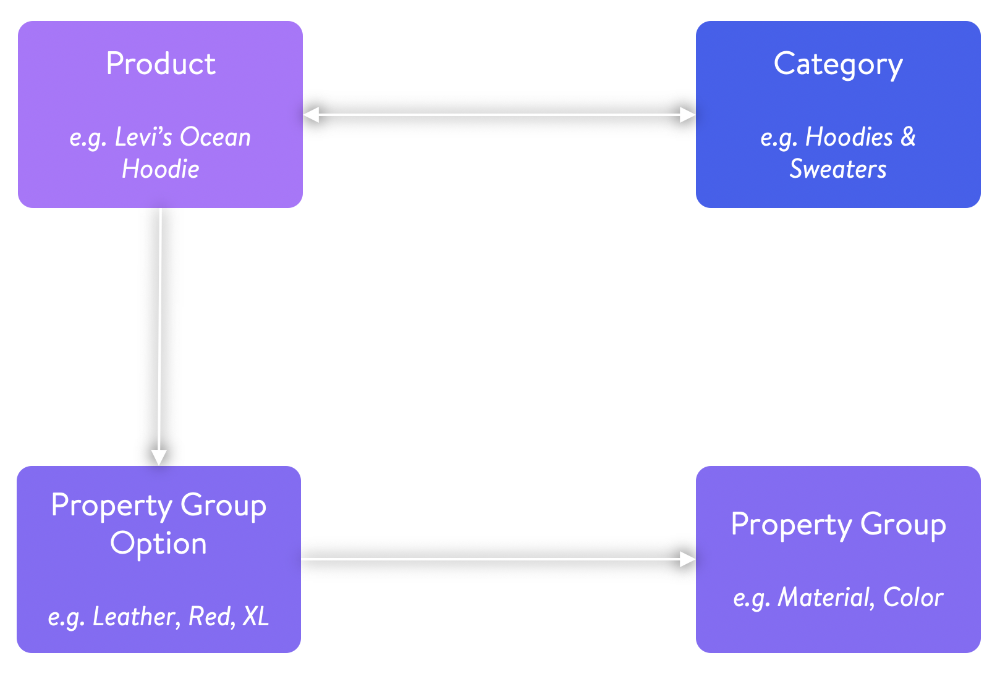

# Home

Let us help you guide through the landscape of knowledge for Shopware 6. This documentation is organised in order to facilitate knowledge for different **products**, **topics** and **depths** of interest.

The Shopware 6 documentation is your main hub to gather knowledge in order to develop extensions and themes. Make sure to take a look at the How-Tos after you've set up your development environment and visit the [academy](https://academy.shopware.com/collections?category=developer-sw6) for video content. If you have any questions left, you can always ask them on [StackOverflow](https://stackoverflow.com/search?q=shopware) or join our awesome community on [Slack](https://slack.shopware.com/).

Some examples to help you get started.


\*\*\*\*[**Getting Started**](guides/getting-started.md)  
Get started and learn about options to set up Shopware.



\*\*\*\*[**Plugin Quick Start**](guides/plugins.md)  
Get an introduction to plugin and app development.



\*\*\*\*[**Theme Quick Start**](guides/themes.md)  
****Want to develop a theme? This guide will get you up to speed.



\*\*\*\*[**API Reference**](resources/untitled/)  
Just here to use the Shopware APIs? We've got you covered!


